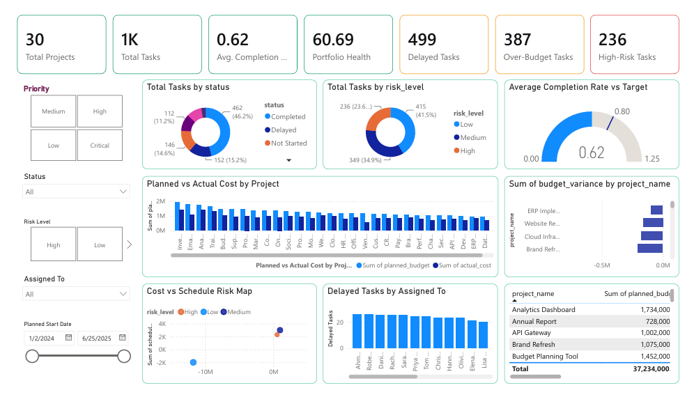

# Program Health & Risk Monitor

An end-to-end project portfolio analytics solution built with Python, SQL, and Power BI. It identifies delivery delays, budget risks, high-risk tasks, owner workload exposure, and overall project health.

## Business problem

Program managers need visibility into task completion, schedule delays, budget variance, ownership, and priority risks across multiple projects. A project can appear financially safe overall while individual tasks are delayed or over budget.

## Project goal

Build a repeatable analytics workflow that:

- Cleans and validates project-task data
- Loads cleaned data into a SQL database
- Calculates task-level risk and project-health scores
- Identifies high-risk tasks and owner workload exposure
- Presents executive insights in a Power BI dashboard

## Technology used

- Python: pandas, sqlite3, openpyxl
- SQL: SQLite
- Business intelligence: Power BI Desktop
- Project tracking: GitHub Projects

## Project workflow

```text
Raw Excel data
    ↓
Python cleaning and data-quality checks
    ↓
Clean CSV and SQLite database
    ↓
SQL portfolio and risk analysis
    ↓
Automated project-risk exception reports
    ↓
Power BI executive dashboard
```

## Key results

- 30 projects analysed
- 1,000 project tasks analysed
- 62.3% average task completion
- 499 delayed tasks
- 387 over-budget tasks
- 236 high-risk tasks
- 60.7 average portfolio health score

## Key insights

- The portfolio is at material delivery risk, with nearly half of all tasks delayed.
- No projects achieved a Green health status under the defined health-scoring criteria.
- Some projects remain under their total budget while containing several over-budget tasks, highlighting hidden task-level cost risk.
- Owner-level reporting helps programme managers prioritise workload balancing and risk escalation.

## Project-health methodology

Each task receives a health score out of 100.

| Risk factor | Score impact |
|---|---:|
| Delayed task | -40 |
| Over-budget task | -30 |
| Cancelled task | -50 |
| High/Critical priority task below 50% completion | -15 |

Project health is calculated as the average task-health score.

| Health score | Status |
|---|---|
| 80 or above | Green |
| 60–79.9 | Amber |
| Below 60 | Red |

## Dashboard

The Power BI dashboard includes:

- Portfolio KPI cards
- Project health-score comparison
- Delayed and high-risk task analysis
- Budget variance analysis
- Owner workload and risk exposure
- High-risk task exception table
- Interactive project, owner, priority, and status filters

## Dashboard preview

_Add a screenshot here after saving it to `dashboard/screenshots/executive_overview.png`._

```md

```

## Repository structure

```text
data/
  raw/                 Original project-management dataset
  processed/           Cleaned data and automated reports
src/                   Python automation scripts
sql/                   SQLite schema and SQL analysis queries
dashboard/             Power BI report and dashboard screenshots
```

## How to run

1. Install the required packages:

```powershell
python -m pip install -r requirements.txt
```

2. Clean and validate the source data:

```powershell
python src/clean_data.py
```

3. Load the cleaned data into SQLite:

```powershell
python src/load_to_sqlite.py
```

4. Create the project-health summary:

```powershell
python src/create_project_health_summary.py
```

5. Run SQL portfolio analysis:

```powershell
python src/run_sql_analysis.py
```

6. Create the high-risk task exception report:

```powershell
python src/create_project_risk_report.py
```

7. Open the Power BI report from the `dashboard/` folder.

## Author

Aman Makhnotra